# gnosis-safe-dapp
A DApp integrated with Gnosis Safe Core SDK to demonstrate how to deploy Safes, create Safe transactions, sign the transactions off-line, and execute the transactions on Rinkeby testnet using multisigs. This project serves as a submodule for [gnosis-safe-rinkeby](https://github.com/celiakwan/gnosis-safe-rinkeby).

### Version
- [React](https://reactjs.org/): 17.0.2
- [Safe Core SDK](https://gnosis-safe.io/): 0.3.1
- [MetaMask](https://metamask.io/): 10.0.2
- [ethers](https://docs.ethers.io/): 5.4.6
- [Node.js](https://nodejs.org/en/): 16.7.0

### Installation
Install `MetaMask` extension in Chrome and create 3 accounts in the MetaMask wallet.

Install Node.js.
```
brew install node
```

Install the required Node.js packages in this project including `React`, `Safe Core SDK` and `ethers`.
```
npm install
```

### Configuration
Create a `.env` file containing the addresses of the deployed Popcat smart contract and 3 signer accounts. In this example, 2 out of 3 account owners are required to sign the transactions. Since this project is created from `create-react-app`, the environment variables should start with `REACT_APP_`.
```
REACT_APP_CONTRACT_ADDRESS="0x24674C1f7403f58E2dAd2157C6782870f5d3a733"
REACT_APP_SIGNER_1="0x8ba7f1A17474590c2f42fC271EAc5e812fD610A8"
REACT_APP_SIGNER_2="0x3d54ec55B8b34f796a3c5EEc2A668B4F2e22bC28"
REACT_APP_SIGNER_3="0x6E7C3D3b970a7C36c15ef45184A04cc64d47ec06"
```

### Get Started
Run the application.
```
npm start
```

1. Open Chrome and go to `http://localhost:3000/`. Current Popcat champion will be empty if no transactions have been executed.
    

2. Connect MetaMask to Rinkeby testnet. To test on Rinkeby, you may probably need to get fake ETH for your accounts from https://faucet.rinkeby.io/. 
    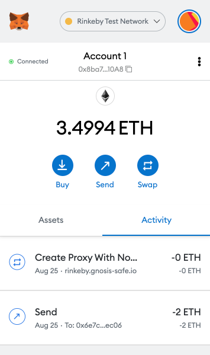

3. Create a Safe and wait until the transaction is confirmed.
    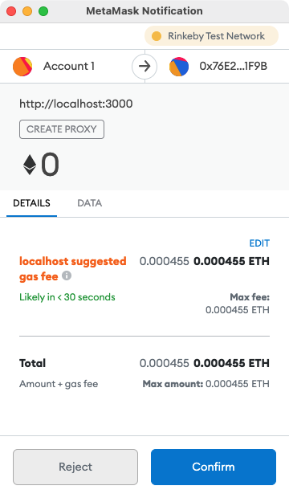
    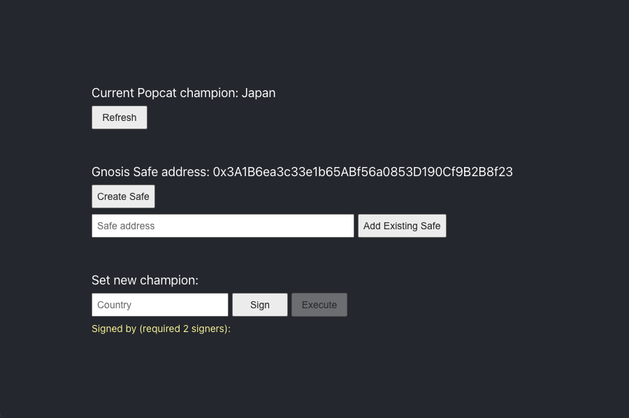

4. Set a new Popcat champion and sign the transaction with Account1.
    
    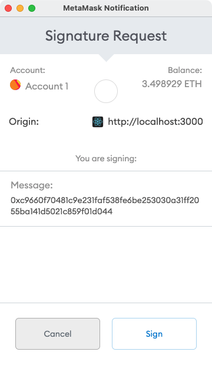
    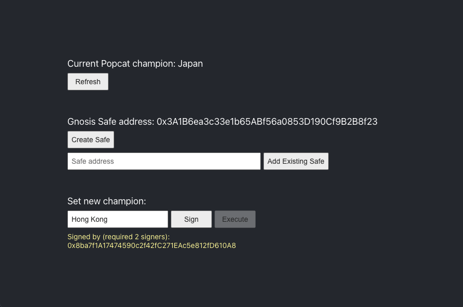

5. Select Account2 in MetaMask and sign the transaction with Account2.
    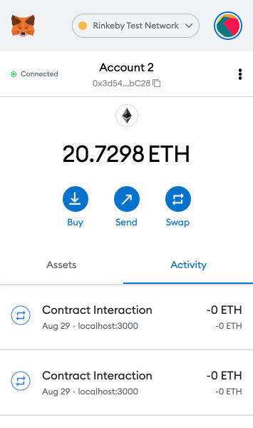
    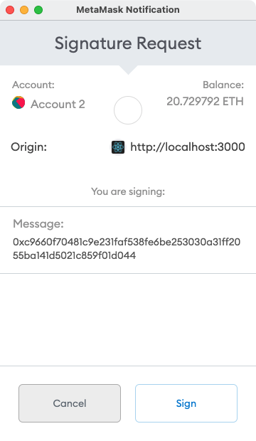
    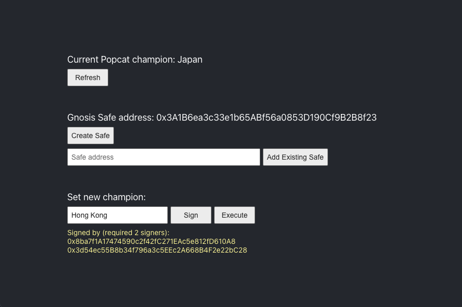

6. Execute the transaction.
    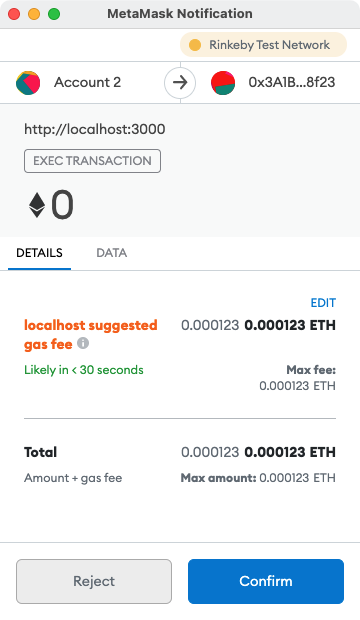

7. Search the transaction in https://rinkeby.etherscan.io/ using the Safe address.
    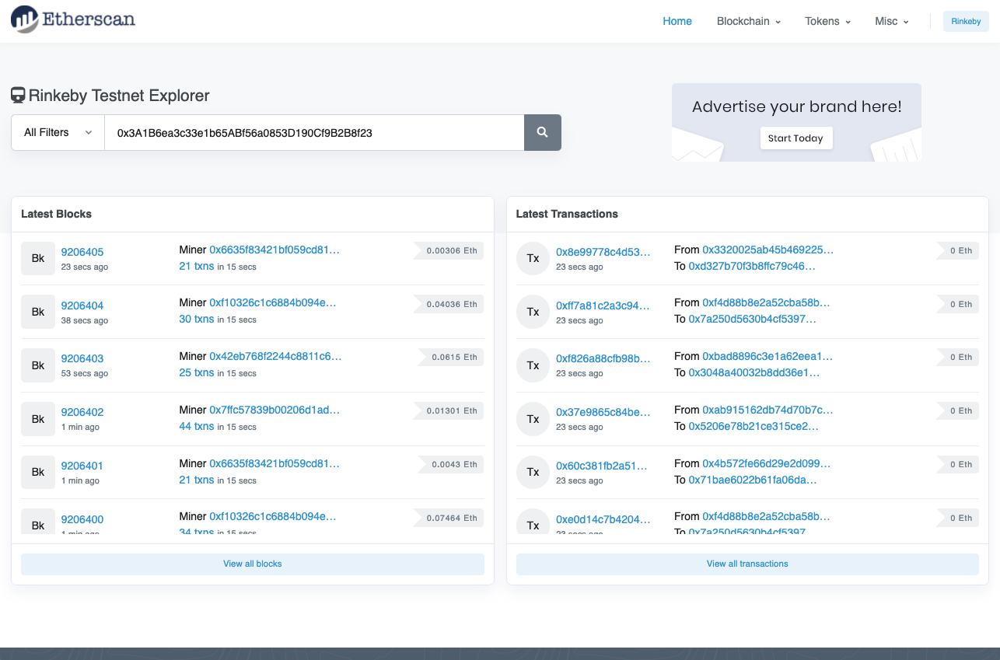
    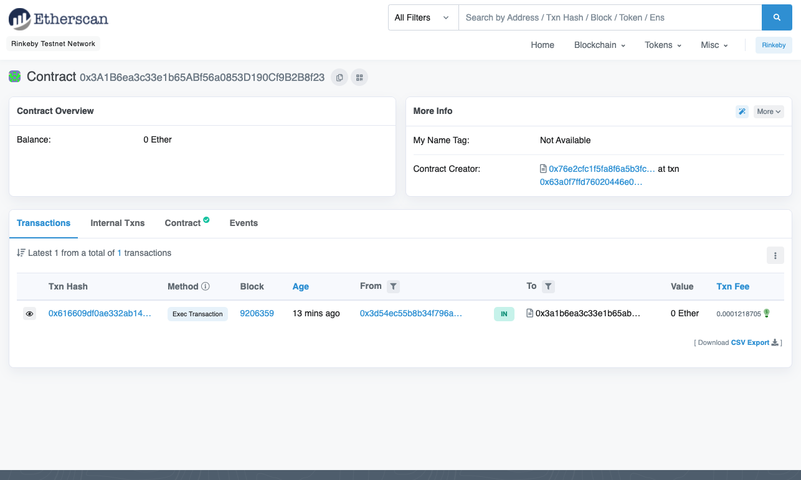

8. Click Refresh after the transaction is confirmed.
    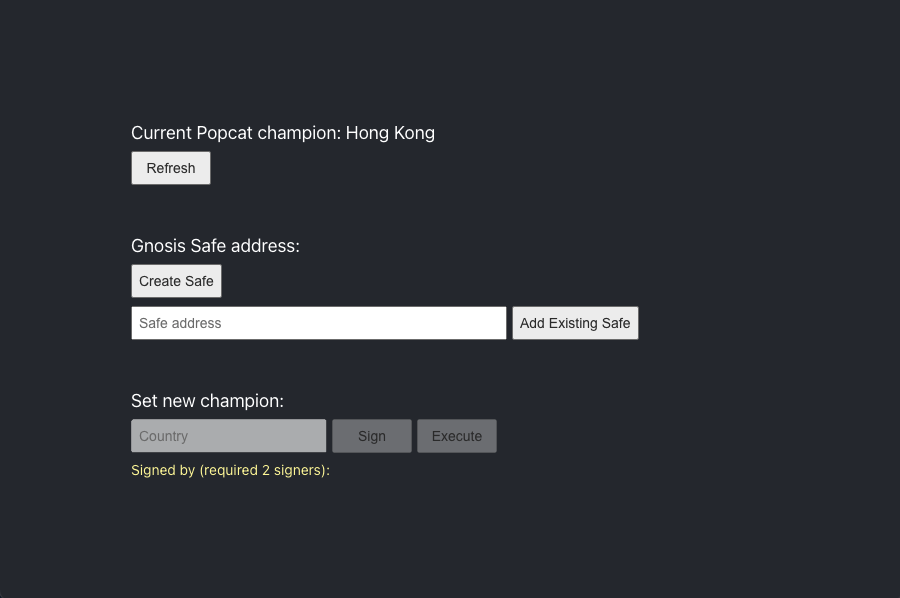

9. You can use the same Safe address to sign and execute more transactions.
    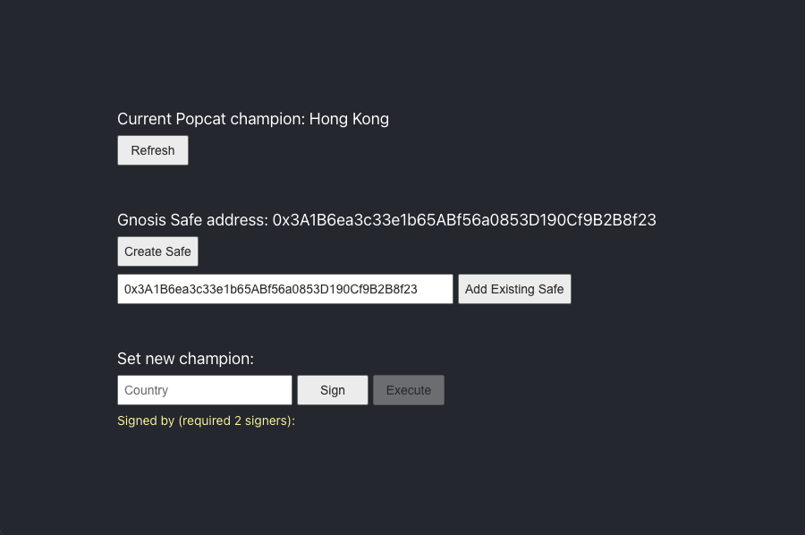
    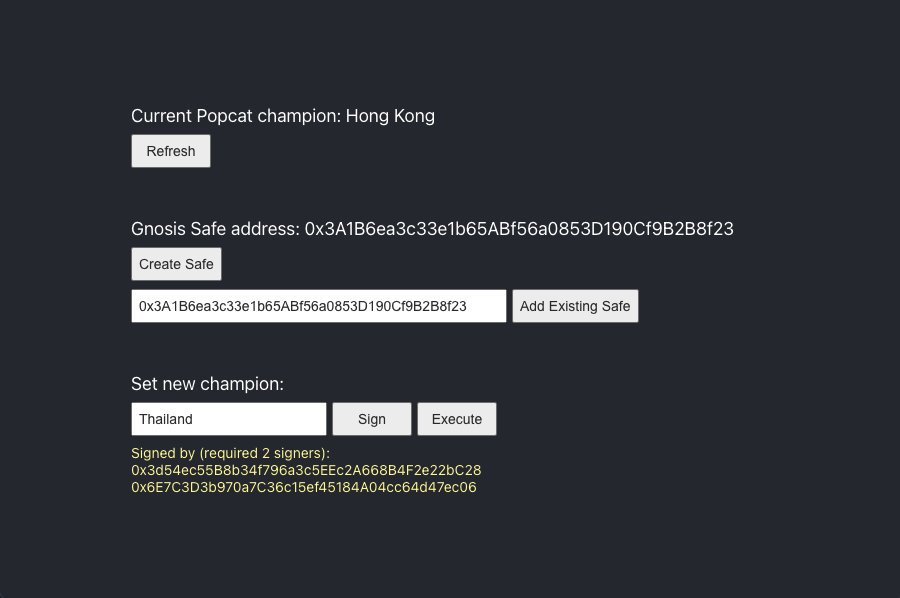